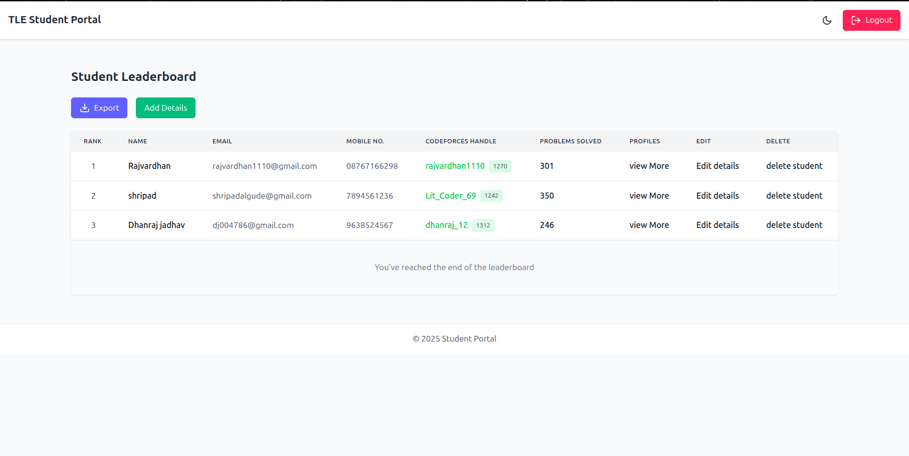
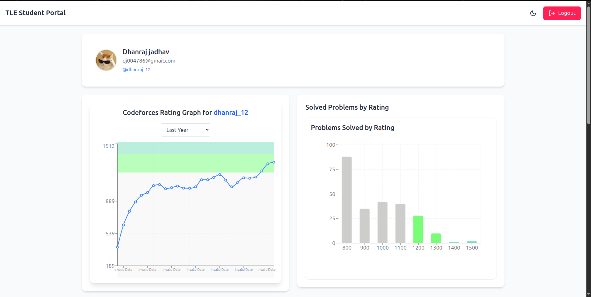

# Tle_Task

## 📝 Description

Tle_Task is a **Student Progress Management System** designed for TLE Eliminators, an EdTech platform focused on competitive programming. The system helps manage student records, visualize Codeforces performance data, detect inactivity, and automate communication—all within an intuitive dashboard.

## 🚀 Features

- 📋 View and manage student records (Add/Edit/Delete/CSV Export)
- 👤 Individual student profile with detailed statistics
- 📈 Contest history visualization (graph + filters)
- 🧠 Problem-solving analytics with heatmaps & bar charts
- 🔄 Daily Codeforces data sync via cron jobs
- ✉️ Inactivity detection and email reminders
- 🌗 Light/Dark mode toggle
- 📱 Mobile and tablet responsive UI

## 🛠️ Technologies Used

- **Programming Language**: JavaScript, TypeScript
- **Frameworks/Libraries**:
  - React.js (Frontend)
  - Node.js + Express (Backend)
  - MongoDB (Database)
  - Charting libraries (Recharts, Heatmap)
- **Tools**: Git, GitHub, Cron Jobs, CI/CD pipelines
- **Database**: MongoDB (for student data and sync logs)

## 📋 Prerequisites

Before running this project, ensure you have:

- Node.js v18+ and npm
- MongoDB installed and running
- Git for version control
- (Optional) Python 3+ for any scripting components

## 🔧 Installation & Setup

1. **Clone the repository**
   ```bash
   git clone https://github.com/dhanraj-12/Tle_Task.git
   cd Tle_Task

2. **Install dependencies**
    ```bash
    npm install


   ```

3. **Configuration**
   - Create a `.env` file in the root directory with the following environment variables:

     ```env
     PORT=5000
     JWT_SECRET=your_jwt_secret_key
     SMTP_USER=your_smtp_user_email
     SMTP_PASS=your_smtp_password
     MONGODB_URI=your_mongodb_connection_string

     # Codeforces API (optional if using rate-limited access)
     CF_API_KEY=your_codeforces_api_key
     CF_API_SECRET=your_codeforces_api_secret
     ```

   - Replace placeholder values with actual credentials.
   - Ensure this file is **not committed to version control** by including `.env` in your `.gitignore`.


## 🎯 Usage


### Basic Usage
```bash
# Start the backend
cd backend
npm run dev
# (Make sure scripts are defined in backend/package.json)

# Start the frontend
cd frontend
npm run dev
```

## 📁 Project Structure

```
Tle_Task/
├── backend/            # Backend folder
│ ├── build/            # Transpiled output (e.g., from TypeScript)
│ └── src/              # Source code
│ ├── cronjobs/         # Scheduled tasks (e.g., daily sync)
│ ├── helpers/          # Utility/helper functions
│ ├── middleware/       # Express middleware (e.g., auth, error handling)
│ ├── models/           # Mongoose models
│ ├── routes/           # Express routes
│ ├── types/            # TypeScript type definitions
│ ├── cfapi.ts          # Codeforces API logic
│ └── index.ts          # Entry point for backend app
│ ├── .env              # Backend environment variables
│ ├── package.json      # Backend dependencies & scripts
│ └── tsconfig.json     # TypeScript configuration
│
├── frontend/           # Frontend folder (React + Vite)
│ ├── src/
│ │ ├── assets/         # Static assets (images, icons)
│ │ ├── Components/     # Reusable React components
│ │ ├── Context/        # React context for state management
│ │ ├── App.jsx         # Main React component
│ │ ├── index.css       # Global styles
│ │ └── main.jsx        # React app entry point
│ ├── .env              # Frontend environment variables
│ ├── index.html        # Main HTML file
│ ├── package.json      # Frontend dependencies & scripts
│ ├── vite.config.js    # Vite configuration
│ └── README.md         # Frontend-specific documentation
│
├── node_modules/       # Root dependencies (if any)
├── .gitignore          # Git ignored files
├── package.json        # Root package (optional, e.g., for concurrently)
├── package-lock.json   # Lock file
└── README.md           # Project documentation
```


## 📸 Screenshots/Demo

If applicable, add screenshots or GIFs demonstrating your project:






## 📽️ Demo Video

Watch the complete walkthrough of Tle_Task here:

- WalkThrough Video: https://drive.google.com/file/d/1xucQyoB8-ipKL5S-ytNnHEa-UAQI7q1Z/view?usp=drive_link


**Dhanraj**
- GitHub: [@dhanraj-12](https://github.com/dhanraj-12)
- Email: [dj004786@gmail.com](dj004786@gmail.com)
- LinkedIn: [Dhanraj Jadhav](https://www.linkedin.com/in/dhanraj-jadhav-473451291/)
- Codeforces: [dhanraj_12](https://codeforces.com/profile/Dhanraj_12)

## 🙏 Acknowledgments

- Thank any contributors
- Credit any resources, tutorials, or inspiration
- Mention any third-party libraries or tools used

## 📞 Support

If you have any questions or need help, please:

1. Check the [Issues](https://github.com/dhanraj-12/Tle_Task/issues) page
2. Create a new issue if your problem isn't already reported
3. Contact the maintainer directly

## 🌟 Show Your Support

Give a ⭐️ if this project helped you!

---
